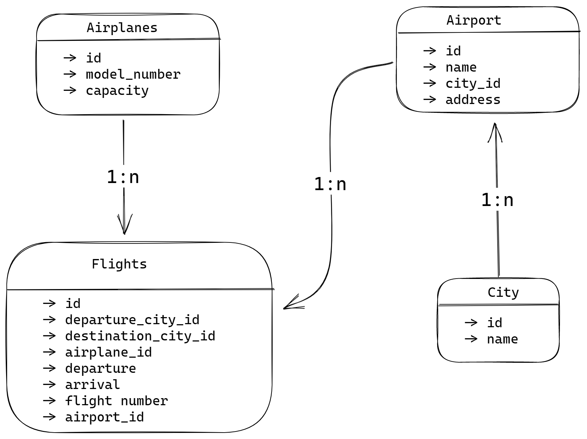

# Welcome to Flight Service

## Folder Structure

```
src/
 | confg/
 | controllers/
 | middlewares/
 | models/
 | repositry/
 | utils/
```

## Project setup

-   Clone the project on your local machine
-   Execute `npm install` on the root path of the cloned project
-   Create `.env` file in the root of your project and add the following variable
    -   `PORT = 3000`
-   Inside the `src/config` folder create a new file `config.json` and the add the following configuration

```json
{
    "development": {
        "username": "<DB_USER_NAME>",
        "password": "<DB_USER_PASSWORD>",
        "database": "Flights_Search_DB_DEV",
        "host": "127.0.0.1",
        "dialect": "mysql"
    }
}
```

-   Once you have added db config as listed above , go to src folder from your terminal and execute `npx sequelize db:create` and then for migration run `npx sequelize db:migrate`

## DB Design



-   Airplane Table
-   Flight Table
-   Airport Table
-   City Table

-   A `flight` belongs to `aeroplane` but one `airplane` can be used in multiple `flights`
-   A `city` has many `airport` but one `airport` belongs to a `city`
-   one `airport` can has may flights, but a flight belong to one airport
